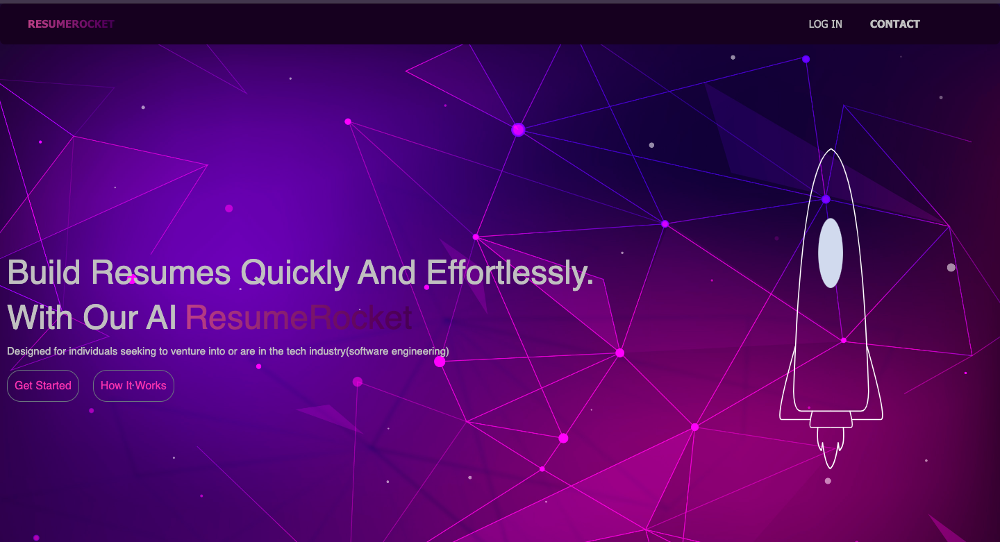

## ResumeRocket
ResumeRocket is an AI-powered resume builder specifically designed for individuals seeking to venture into the tech industry, particularly software engineering. Our goal is to make the process of creating a professional and effective resume as interactive and straightforward as possible.



## Authors

- **Habiba Adam Salisu =>** @habibaadam
- **Mark Musili =>** @MarkMusili
- **Memory Mukonda =>** @mukoe2020
- **Ote Ian =>** @Otelan

## Core Feature(MVP)
- **Interactive Questionnaire:** Users will be guided through a series of simple and interactive questions to determine the key features of their resume or CV. This ensures that the AI model has all the necessary information to create a compelling and personalized resume, which can be downloaded simply.


### Additional and Incoming Features
- **Personalized Recommendations:** If a user lacks certain skills or experiences related to their desired job role, our AI model will suggest relevant certifications or trainings to help them upskill.

- **More Tailored Resumes for other Jobs:** Our Ai model will be further trained to produce resumes for a more vast audience or target group from different jobs.

## Technology Stack

- **Server Side:** Node.js
- **API Endpoints:** Express.js
- **Database:** MongoDB
- **Frontend:** React.js

## Getting Started

To get started with ResumeRocket, you need to clone the repository to your local machine.

```bash
git clone https://github.com/yourusername/ResumeRocket.git

cd ResumeRocket

You would need to have an env containing credentials for mongo db, jwt signature and an api key
from your ai model
```


Next, install the necessary dependencies provided from our package.json scripts:

```bash
npm install

npm run start

This will start the server side on port 5000.

Navigate to client-src/rocket-front

run npm start

This will start the server side on port 3001.

```

## Contributing
We welcome contributions to ResumeRocket. If you'd like to contribute, please fork the repository, make your changes, and submit a pull request. We promise to review it as soon as possible.

## License
ResumeRocket is licensed under the MIT license.